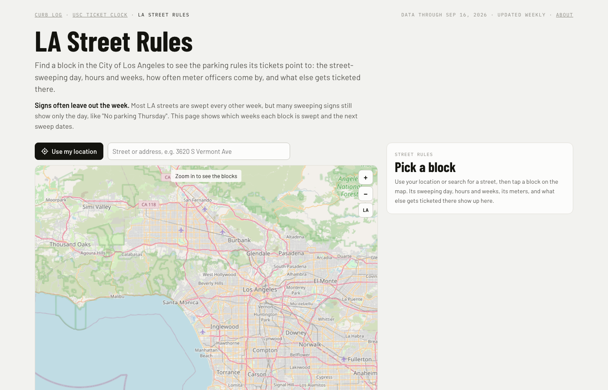
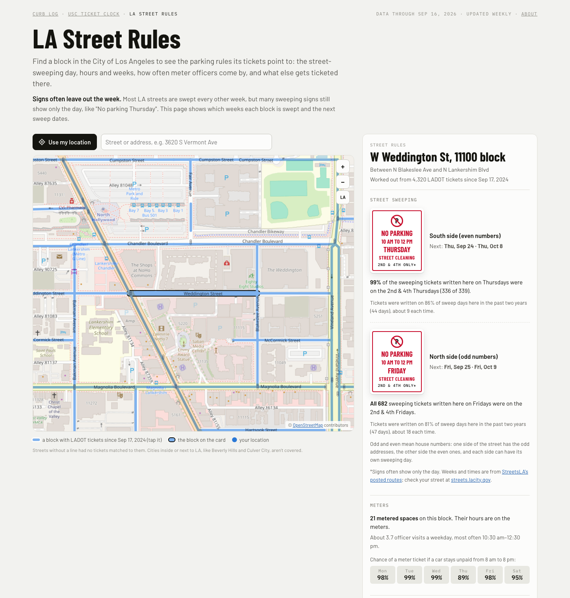
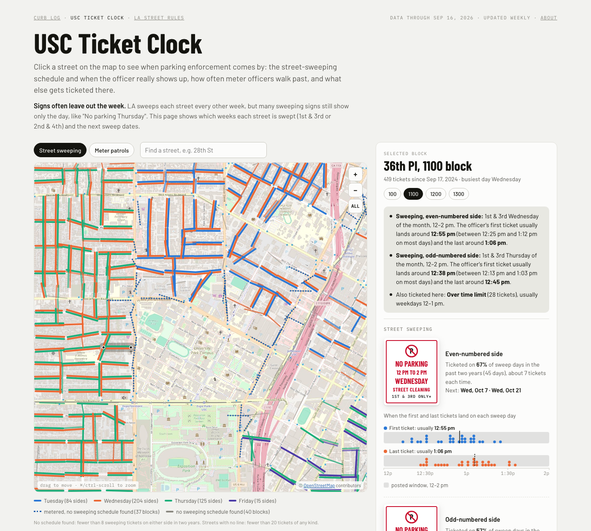

# Ticket Clock

**[LA Street Rules](https://citina.github.io/ticket-clock/streets/)** shows the parking
rules on any block in the City of Los Angeles: the street-sweeping day, hours and weeks,
how often meter officers come by, and every kind of ticket written there — worked out
from the last two years of LADOT's own tickets, matched to the city's street centerlines
by address. **[USC Ticket Clock](https://citina.github.io/ticket-clock/)** is where this
started, and goes deeper for the streets around campus: about 315k tickets since 2014 in
a 2.5 × 2.5 km box around University Park, using the same posted-route rule for sweeping.

LA sweeps most streets every other week, but many signs still show only the day, and near
USC I kept guessing when enforcement would actually come by. The city has already written
the answer, one ticket at a time. This project reads it — first for the streets around
campus, then, once the pipeline worked, for every block in the city.


*LA Street Rules covers every block in the city — search a street or address, or use your location.*


*The 11100 block of W Weddington St — the block with the most sweeping tickets of any street swept every other week. Both sides' signs, the next dates, and the odds of a meter ticket by day.*


*USC Ticket Clock goes deeper per block: when the sweeping officer's first ticket usually lands, down to the minute, on each side of the street.*

Pick a block on either page and it shows:

- **Street sweeping, per side:** the posted day and window, whether it's the 1st & 3rd
  or 2nd & 4th week, how often a sweep day actually gets ticketed, and the next posted
  dates. USC Ticket Clock adds when the officer's first ticket usually lands, one dot per
  sweep day.
- **Meter patrols (metered blocks):** how often an officer walks by, and the odds of a
  ticket if you never pay — by day of week on LA Street Rules, and by arrival time and
  length of stay, half hour by half hour, on USC Ticket Clock.
- **Everything else ticketed there,** with the fine and the usual time of day.

USC Ticket Clock also has campus-wide evidence below the map: every-other-week sweeping,
officer arrival times, meter waves.

A companion to [Curb Log](https://citina.github.io/curb-log/), which uses
LADOT's sensors to measure available parking on Vermont Ave from W 36th St down to about
W 37th St (both sides), and on W 36th St just west of Vermont.

## Disclaimer

This project is not meant to encourage anyone to break parking rules or park
illegally. It shows when and where LADOT has written tickets, so the rules on each
block, and how they're enforced, are easier to understand. Past tickets don't
predict the next one: an officer can come by at any time, and a quiet hour in the
data can still end in a ticket.

**Street sweeping signs.** LA has swept each street every other week since March 2021
(the 1st & 3rd or the 2nd & 4th time its weekday comes up in a month), but many signs
were never updated and still show only the day, like "No parking Thursday". LADOT says
parking is legal on a street's off weeks
([Larchmont Chronicle, March 2025](https://larchmontchronicle.com/to-adhere-to-parking-signs-or-not-to-adhere/)),
and when the change began it said officers would enforce street sweeping only on days
that sweeping happens ([LADOT, March 2021](https://ladot.lacity.gov/dotnews/weekly-update-march-4-2021)).
The days, weeks and times this project shows come from
[StreetsLA's list](https://www.arcgis.com/home/item.html?id=0e16fa641a0846a3ae29bffb150314dc) of posted routes (about 98% of sweeping tickets near campus fall
on those weeks); only which side of a street gets which day is worked out from the
tickets. To check your own street, look it up at
[streets.lacity.gov](https://streets.lacity.gov/services/street-sweeping).

## Run it

```
./fetch_city.py        # data/city/: two years of city-wide tickets (~450 MB), street centerlines, meter inventory, posted sweeping routes
./analyze_city.py      # docs/streets/data/ (~16 MB of JSON, not committed); serve docs/ and open /streets/
./neighborhoods.py     # docs/streets/hoods.json (the map's neighborhood outlines, committed; only rerun if the city updates them)

./fetch_citations.py   # data/citations_usc.csv (~45 MB, data.lacity.org 4f5p-udkv), data/meters_usc.csv (meter inventory, s49e-q6j2),
                       # data/sweep_routes.geojson (StreetsLA posted sweeping routes, ArcGIS Online)
./basemap.py           # docs/basemap.jpg (36 OpenStreetMap tiles at zoom 16, cached in .tilecache/)
./analyze.py           # data/bundle.json (every number the USC page shows)
./build.py             # docs/index.html (one self-contained file)
```

Python 3 with pandas, numpy, scipy and Pillow. The raw downloads and the tile cache
are not committed; they regenerate from the commands above.

## Weekly update

`.github/workflows/weekly.yml` reruns both pipelines every Monday on GitHub Actions.
One job rebuilds LA Street Rules' city-wide data and uploads it to the `city-data`
release (overwritten each week, so the repo doesn't grow); `pages.yml` copies that
release into `docs/streets/data/` before publishing. Its raw downloads are kept in the
`city-downloads` release, so each run only refreshes the recent ticket months, a few
older ones, and the street centerlines once a month; if a city server is down, it keeps
the older copy and says so in the run log. A file with no older copy stops the run, but
everything else it downloaded is still kept, so the next run only needs that file. If
the city data's ticket count falls more than 10%, or a month comes back thin, that job
stops and last week's release stays up.

A second job reruns fetch, analyze and build for USC Ticket Clock, commits the new
`data/bundle.json` and `docs/index.html`, and starts `pages.yml` to publish `docs/`. If
the ticket count falls more than 1% from the last build, it stops without publishing.
USC term dates in `citations.py` run through fall 2027; the run log warns once the
newest ticket is past them.

Run either by hand with `gh workflow run weekly.yml`.

| File | What it is |
|---|---|
| `fetch_city.py` | city-wide downloads for LA Street Rules, a rolling two years of tickets |
| `analyze_city.py` | address matching to street centerlines, per-block rules, ~1 km map cells, search index |
| `docs/streets/index.html` | LA Street Rules, hand-written (no build step); its map images load live from OpenStreetMap |
| `neighborhoods.py` | the LA Times' City of LA neighborhood outlines for LA Street Rules' map, from LA GeoHub |
| `citations.py` | shared loading: address parsing, street-name cleanup, holidays, USC term dates, posted sweeping routes, map projection |
| `analyze.py` | per-block geometry, sweeping schedule per side, meter visit rates, campus charts |
| `template.html` | the USC page; `build.py` fills in the data and the basemap |

## Method in brief (USC Ticket Clock)

LA Street Rules documents its own method on the page itself, under "How this was
measured" — its thresholds and ticket-kind codes differ slightly from USC Ticket
Clock's, described here:

- **Window.** Patterns use the two years up to the newest ticket (a rolling window),
  so they describe how enforcement works now.
- **Blocks.** Hundred block of each address; odd and even numbers are the two sides.
  East addresses (across Main St) are their own blocks, like "E 35th St".
  A block's map line is fitted through its ticket locations. Where the two sides
  geocode to clearly opposite sides of it (13 blocks), the page names the compass side.
- **Sweeping.** Street-cleaning tickets are code 80.69BS (a few handhelds write it
  8069BS; both count). A block side needs 8 of them in the window to get a schedule;
  the map calls the rest "no sweeping schedule found". The posted day, weeks (1st & 3rd
  or 2nd & 4th) and time come from StreetsLA's posted routes. Each route covers an area
  and runs on two days, one per side of the street; a side gets the route day on its
  most common ticket weekday, among the routes its tickets sit inside. 98% of sweeping
  tickets fall on the posted weeks. The handful written outside the posted time (15 of
  about 19,700 in September 2026) are left off the arrival strips; `analyze.py` prints
  the current count.
  "Ticketed on X% of sweep days" excludes holidays and days with no sweeping tickets
  anywhere nearby.
- **Metered blocks.** From LADOT's meter inventory, so blocks whose meters never drew
  a ticket still count (tickets alone miss 3800 Figueroa and 2600 Vermont). On the
  map they're dotted where the current view has nothing else to show for them.
- **Meters.** USC class weeks, Monday–Saturday, 8 am–8 pm. A visit = meter tickets on
  one block with gaps ≤ 10 min. A visit that finds every meter paid leaves no trace,
  so the visit rate is scaled up assuming expired cars per visit are Poisson (the mean
  tickets per visible visit gives the share of empty visits). "At least" figures skip
  that correction.

A ticket needs a violator, so quiet blocks look less patrolled than they are. None
of this replaces the posted sign.

Data: LADOT Parking Citations, data.lacity.org. Posted Street Sweeping Routes, StreetsLA.
Basemap © OpenStreetMap contributors.

## Who made this

Citina Liang, a PhD candidate in Industrial & Systems Engineering at USC
Viterbi, who models how people behave and how diseases spread to help public health make
better decisions, with Claude Code — from first commit to covering every block in the
city in about a week (9–16 Sep 2026). LA Street Rules and USC Ticket Clock are the
second and third of three pages about parking in Los Angeles; the first is
[Curb Log](https://github.com/citina/curb-log).
